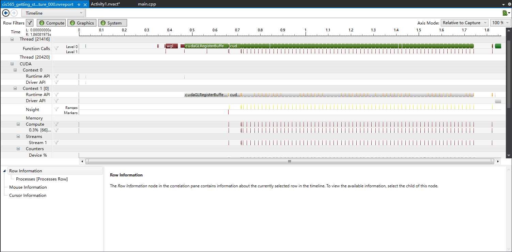

Project 0 Getting Started
====================

**University of Pennsylvania, CIS 565: GPU Programming and Architecture, Project 0**

* Name: Li Zheng
* Tested on: Windows CUDA10, i5-3600 @ 3.59GHz 16GB, RTX 2060 6GB (personal computer)

  
  
  
  
  
  
